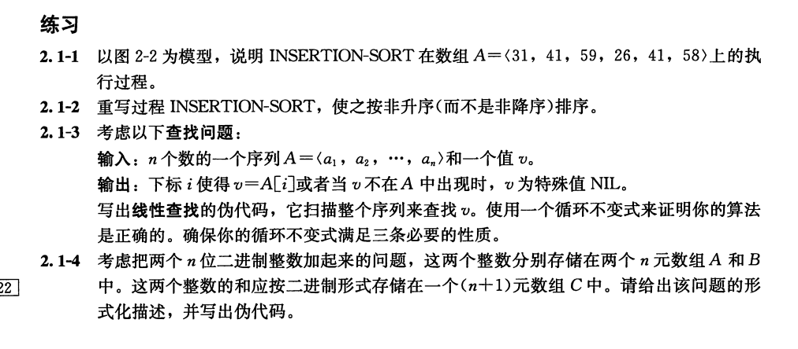
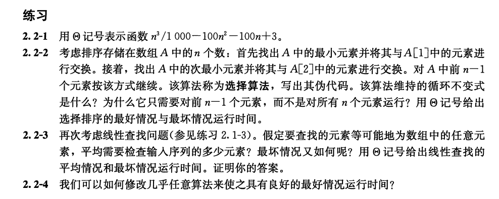

# 算法基础
## 插入排序
问题：给定数组A[1..n],用插入排序法对其升序。
对于插入排序，其中的参数是一个数组A[1..n]，包含长度为n的要排序的一个序列。
我们将其伪代码过程命名为INSERTION-SORT（在代码中，A中元素的数目n用A.length来表示。）：
```
INSERTION-SORT(A)
for j = 2 to A.length
  key = A[j]
  //Insert A[j] into the sorted sequence A[1..j -1].
  i=j-1
  while i > O and A[i]> key  //遍历j至1，当前一个数据A[i]>插入数据(key)时，将A[i]右移，直到A[i]<key跳出循环，并在该位置插入数据
    A[i+1] = A[i]  // 右移前一个数据
    i=i-1  //刷新插入数据的前一个值的坐标
 A[i + 1] = key // 插入数据
```

引出循环不变式：
在第1~8行的for循环的每次迭代开始时，子数组A[1..j-1]由原来在A[1..j-1]
中的元素组成，且已按升序排列。

**循环不变式三条性质：**
循环不变式主要用来帮助我们理解算法的正确性。
关于循环不变式，我们必须证明三条性质：
- 初始化：循环的第一次迭代之前，它为真。
- 保持：如果循环的某次迭代之前它为真，那么下次迭代之前它仍为真。
- 终止：在循环终止时，不变式为我们提供一个有用的性质，该性质有助于证明算法是正确的。

插入排序证明循环不变式三条性质：
- 初始化：首先证明在第一次循环选代之前（当j=2时），循环不变式成立。子数组A[1..j-1]仅由单个元素A[1]组成，
实际上就是A[1]中原来的元素。而且该子数组是排序好的。这表明第一次循环迭代之前循环不变式成立。
- 保持：其次处理第二条性质：证明每次选代保持循环不变式。非形式化地，for循环体的第4~7行将A[j-1]、A[j-2]、A[j-3]等向右移动一个位置，
直到找到A[j]的适当位置，第8行将A[j]的值插人该位置。这时子数组A[1..j]由原来在A[1..j]中的元素组成，但已按序排列。
那么对for循环的下一次选代增加j将保持循环不变式。第二条性质的一种更形式化的处理要求我们对第5~7行的while循环给出并证明一个循环不变式。
然而，这里我们不愿陷人形式主义的困境，而是依赖以上非形式化的分析来证明第二条性质对外层循环成立。
- 终止：最后研究在循环终止时发生了什么。导致for循环终止的条件是j>A.length=n。
因为每次循环选代j增加1，那么必有j=n+1。在循环不变式的表述中将j用n+1代替，
我们有：子数组A[1..n]由原来在A[1..n]中的元素组成，但已按序排列。
注意到，子数组A[1..n]就是整个数组，我们推断出整个数组已排序。
因此算法正确。


前两题略，这里直接写后面两题：
```伪代码
LINER-FIND(A)
i = n; // i = A数组长度
while i > 0 and A[i] != v //遍历i至1，当A[i]=v时跳出循环，此时A[i]=v；当所有值都遍历完时i=0,此时v=NULL
  i--   // i值减1
if i = 0
  v = NULL
else
  输出i值
```
循环不变式：
每次迭代开始时，已查找的A组元素中都不等于v。
证明性质：
- 初始化：第一次迭代前，并未对A组元素进行判断，因此查找元素为空，即不存在出现v值，循环不变式成立。
- 保持： 进入while循环之一的条件就是A[i]不等于v值，因此进入循环体，有已遍历的A[i..n]所有元素都不等于v，循环不等式成立。
- 终止：终止条件i=0或A[i]不等于v。 if语句中，当i=0时，v=NULL 符合算法输出值。当i!=0时，此时循环提前跳出，说明此时A[i]=v，算法成立。

## 分析插入排序算法
一般来说，算法需要的时间与输人的规模同步增长，所以通常把**一个程序的运行时间描述成其输人规模的函数**。

输入规模：输入规模的最佳概念依赖于研究的问题。对许多问题，如排序或计算离散傅里叶变换，最自然的量度是输入中的项数，
例如，待排序数组的规模n。对其他许多问题，如两个整数相乘，输人规模的最佳量度是用通常的二进制记号表示输入所需的总位数。
有时，用两个数而不是一个数来描述输人规模可能更合适。例如，若某个算法的输入是一个图，则输人规模可以用该图中的顶点数和边数来描述。
对于研究的每个问题，我们将指出所使用的输人规模量度。
运行时间：一个算法在特定输人上的运行时间是指执行的基本操作数或步数。定义“步”的概念以便尽量独立于机器是方便的。
目前，让我们采纳以下观点，执行每行伪代码需要常量时间。虽然一行与另一行可能需要不同数量的时间，但是我们假定第i行的每次执行需要时间c；
其中c是一个常量。这个观点与RAM模型是一致的，并且也反映了伪代码在大多数真实计算机上如何实现。

对于插入排序，最好的运行时间为n的线性函数，最坏的运行时间为n的指数函数。(证明过程见原书14、15页)

对于评估一个算法，一般算它的最坏运行时间，因为以下三点：
- 一个算法的最坏情况运行时间给出了任何输人的运行时间的一个上界。知道了这个界，就能确保该算法绝不需要更长的时间。
我们不必对运行时间做某种复杂的猜测并可以期望它不会变得更坏。
- 对某些算法，最坏情况经常出现。例如，当在数据库中检索一条特定信息时，若该信息不在数据库中出现，则检索算法的最坏情况会经常出现。在某些应用中，对缺失信息的检索可能是频繁的。
- “平均情况”往往与最坏情况大致一样差。


## 设计算法

### 分治法

### 分析分治法