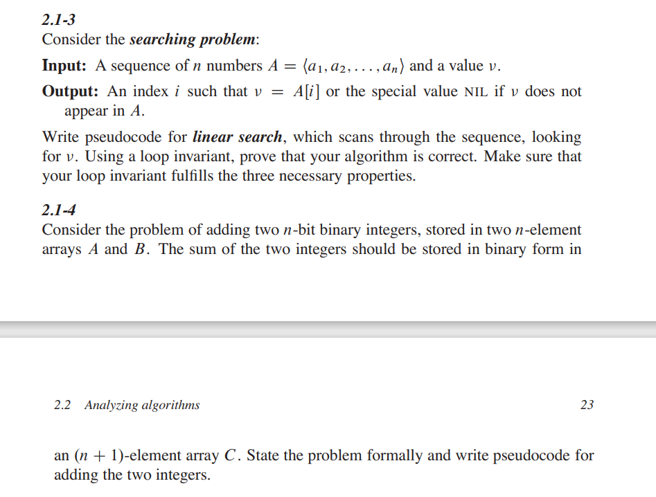
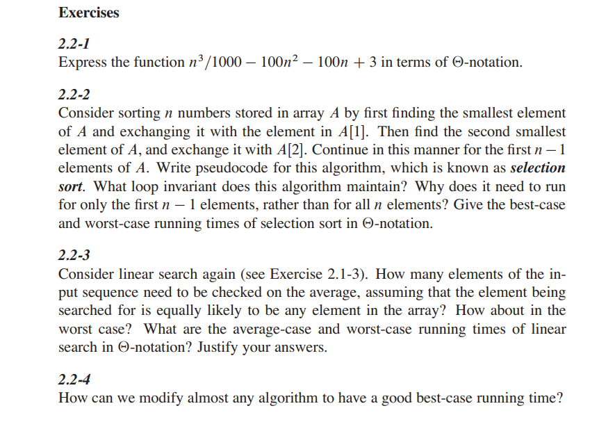
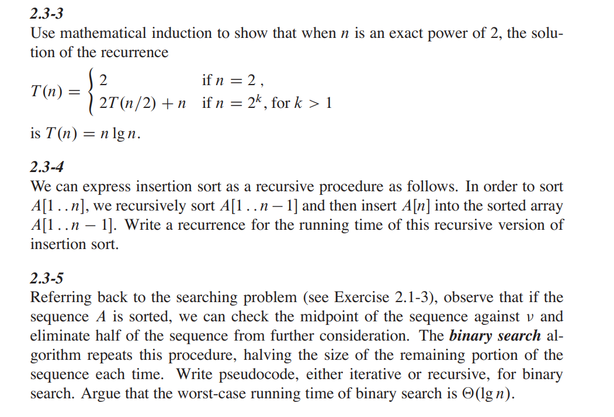
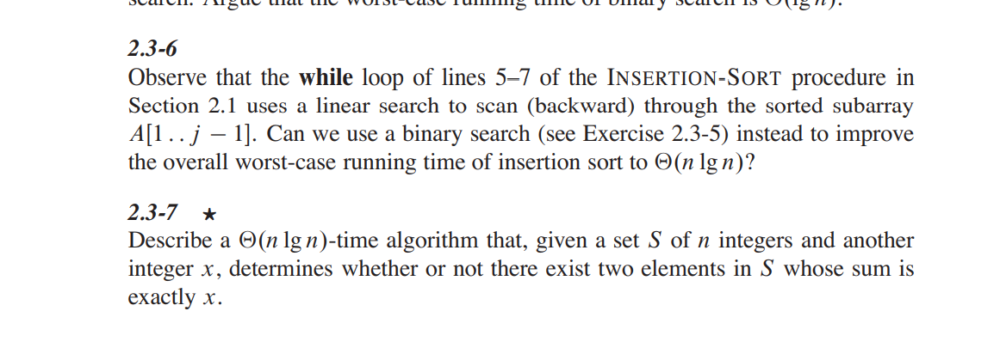

# 算法基础
## 插入排序
问题：给定数组A[1..n],用插入排序法对其升序。
对于插入排序，其中的参数是一个数组A[1..n]，包含长度为n的要排序的一个序列。
我们将其伪代码过程命名为INSERTION-SORT（在代码中，A中元素的数目n用A.length来表示。）：
```
INSERTION-SORT(A)
for j = 2 to A.length
  key = A[j]
  //Insert A[j] into the sorted sequence A[1..j -1].
  i=j-1
  while i > O and A[i]> key  //遍历j至1，当前一个数据A[i]>插入数据(key)时，将A[i]右移，直到A[i]<key跳出循环，并在该位置插入数据
    A[i+1] = A[i]  // 右移前一个数据
    i=i-1  //刷新插入数据的前一个值的坐标
 A[i + 1] = key // 插入数据
```

引出循环不变式：
在第1~8行的for循环的每次迭代开始时，子数组A[1..j-1]由原来在A[1..j-1]
中的元素组成，且已按升序排列。

**循环不变式三条性质：**
循环不变式主要用来帮助我们理解算法的正确性。
关于循环不变式，我们必须证明三条性质：
- 初始化：循环的第一次迭代之前，它为真。
- 保持：如果循环的某次迭代之前它为真，那么下次迭代之前它仍为真。
- 终止：在循环终止时，不变式为我们提供一个有用的性质，该性质有助于证明算法是正确的。

插入排序证明循环不变式三条性质：
- 初始化：首先证明在第一次循环选代之前（当j=2时），循环不变式成立。子数组A[1..j-1]仅由单个元素A[1]组成，
实际上就是A[1]中原来的元素。而且该子数组是排序好的。这表明第一次循环迭代之前循环不变式成立。
- 保持：其次处理第二条性质：证明每次选代保持循环不变式。非形式化地，for循环体的第4~7行将A[j-1]、A[j-2]、A[j-3]等向右移动一个位置，
直到找到A[j]的适当位置，第8行将A[j]的值插人该位置。这时子数组A[1..j]由原来在A[1..j]中的元素组成，但已按序排列。
那么对for循环的下一次选代增加j将保持循环不变式。第二条性质的一种更形式化的处理要求我们对第5~7行的while循环给出并证明一个循环不变式。
然而，这里我们不愿陷人形式主义的困境，而是依赖以上非形式化的分析来证明第二条性质对外层循环成立。
- 终止：最后研究在循环终止时发生了什么。导致for循环终止的条件是j>A.length=n。
因为每次循环选代j增加1，那么必有j=n+1。在循环不变式的表述中将j用n+1代替，
我们有：子数组A[1..n]由原来在A[1..n]中的元素组成，但已按序排列。
注意到，子数组A[1..n]就是整个数组，我们推断出整个数组已排序。
因此算法正确。

### 习题2.1

前两题略
第三题 线性查找：
```伪代码
LINER-FIND(A)
for i in A
  if A[i] == v
  return i
return NULL
```
循环不变式：
每次迭代开始时，已查找的A组元素中都不等于v。
证明性质：
- 初始化：第一次迭代前，并未对A组元素进行判断，因此查找元素为空，即不存在出现v值，循环不变式成立。
- 保持： 进入循环之一的条件就是A[i-1]不等于v值，因此进入循环体，有已遍历的A[1..i-1]元素都不等于v，循环不等式成立。
- 终止：终止条件 A[i]等于v。 当循环提前终止时返回i值;当循环遍历结束，A组元素均查找完且都不等于v，此时返回NULL，算法成立。

第四题 二进制加法：
```伪代码
ADD-BINARY(A, B)
C = new Integer[A.length + 1] //初始化C数组长度为n+1
carry = 0 //进位
for (i = A.length; i>0; i--) // 从二进制的低位到高位  也就是数组顺序从高到低
    C[i+1] = (A[i] + B[i] + carry) % 2  // A、B的i位及后一位的进位相加然后除2的余数 标识C的第i+1位  
    carry = (A[i] + B[i] + carry) / 2 // 更新进位 
C[1] = carry  C最高位为结束时的进位
return C
```
### 分析插入排序算法
一般来说，算法需要的时间与输人的规模同步增长，所以通常把**一个程序的运行时间描述成其输人规模的函数**。

输入规模：输入规模的最佳概念依赖于研究的问题。对许多问题，如排序或计算离散傅里叶变换，最自然的量度是输入中的项数，
例如，待排序数组的规模n。对其他许多问题，如两个整数相乘，输人规模的最佳量度是用通常的二进制记号表示输入所需的总位数。
有时，用两个数而不是一个数来描述输入规模可能更合适。例如，若某个算法的输入是一个图，则输入规模可以用该图中的顶点数和边数来描述。

对于研究的每个问题，我们将指出所使用的输入规模量度。
运行时间：一个算法在特定输人上的运行时间是指执行的基本操作数或步数。

现在让我们使用以下观点，执行每行伪代码需要常量时间。虽然一行与另一行可能需要不同数量的时间，但是我们假定第i行的每次执行需要时间c；
其中c是一个常量。这个观点与RAM模型是一致的，并且也反映了伪代码在大多数真实计算机上如何实现。

对于插入排序，最好的运行时间为n的线性函数，最坏的运行时间为n的指数函数，其实就是算伪代码执行步长之和。(证明过程见原书14、15页)

对于评估一个算法，一般算它的最坏运行时间，因为以下三点：
- 一个算法的最坏情况运行时间给出了任何输人的运行时间的一个上界。知道了这个界，就能确保该算法绝不需要更长的时间。
我们不必对运行时间做某种复杂的猜测并可以期望它不会变得更坏。
- 对某些算法，最坏情况经常出现。例如，当在数据库中检索一条特定信息时，若该信息不在数据库中出现，则检索算法的最坏情况会经常出现。在某些应用中，对缺失信息的检索可能是频繁的。
- “平均情况”往往与最坏情况大致一样差。


### 增长量级
如何抽象并简化上述代码所花费的时间代价，即我们真正感兴趣的运行时间的增长率或增长量级？
对于多项式来说，考虑公式中最重要的项（例如，an^2）因为当n的值很大时，低阶项相对来说不太重要。
我们也忽略最重要的项的常系数，因为对大的输入，在确定计算效率时常量因子不如增长率重要。
对于插人排序，当我们忽略低阶项和最重要的项的常系数时，只剩下最重要的项中的因子n^2。我们记插人排序具有最坏情况运行时间O（n）（读作"theta n平方”）。本章非形式化地使用，第3章将给出其精确定义。

总结，对于类似多项式，常数项忽略，低次幂项可以忽略。

如果一个算法的最坏情况运行时间具有比另一个算法更低的增长量级，那么我们通常认为前者比后者更有效。
由于常量因子和低阶项，对于小的输入，运行时间具有较高增长量级的一个算法与运行时间具有较低增长量级的另一个算法相比，其可能需要较少的时间。
但是对足够大的输人，例如，一个O（n）的算法在最坏情况下比另一个O（n^2）的算法要运行得更快。

### 习题2.2 


第一题，用大O记法表示上述函数：
)

第二题，选择算法伪代码：
```
SELECTION-SORT(A)
for i = 1 to A.length - 1                               c1  n-1
  min = i                                               c2  n-1
  for j = i + 1 to A.length // 循环求子元素最小值坐标       c3  2+...+n
     if A[j] < A[min]                                   c4  2+...+n
        min = j                                         c5  
  temp = A[i]                                           c6 n-1
  A[i] = A[min]                                         c7 n-1
  A[min] = temp  交换A[i]和A[min]                        c8 n-1
```
循环不变式： 最外层for循环开始时，保证A[1..i-1]为A数组中最小的i-1个元素，且A[i-1]为升序排列。

为什么是n-1? : 当最外层n-1执行，子元素就剩A[n]，此时内循环就1个元素，这时已经开始对A[n]和A[n-1]比较了，所以最外层没必要再执行下一个循环(即第n次)。

最好c5=0  最坏c5=c4 


最好运行时间：c1+c2+c3+c4+c6+c7+c8  

最坏运行时间：c1+c2+c3+c4+c5+c6+c7+c8 

其中c3,c4,c5(最坏情况)均为等差数列求和，最高次项为c*n^2，即该算法最好与最坏运行时间均为O(n^2)

第三题：
如果元素出现在序列中，那么在平均情况下，会检查一半的元素，即1/2n次检查。在最坏的情况下，将检查所有元素，即n次检查。两种情况均为O(n)。

第四题：
使用条件语句，符合某种情况提前return，减少不必要的执行代码。

## 设计算法
### 分治法
许多有用的算法在结构上是递归的：为了解决一个给定的问题，算法一次或多次递归地调用其自身以解决紧密相关的若干子问题。

这些算法典型地遵循分治法的思想：将原问题分解为几个规模较小但类似于原问题的子问题，递归地求解这些子问题，然后再合并这些子问题的解来建立原问题的解。

分治模式在每层递归时都有三个步骤：
- 分解原问题为若干子问题，这些子问题是原问题的规模较小的实例。
- 解决这些子问题，递归地求解各子问题。然而，若子问题的规模足够小，则直接求解。
- 合并这些子问题的解成原问题的解。

归并排序算法完全遵循分治模式。直观上其操作如下：
- 分解：分解待排序的n个元素的序列成各具n/2个元素的两个子序列。
- 解决：使用归并排序递归地排序两个子序列。
- 合并：合并两个已排序的子序列以产生已排序的答案。

```伪代码

```

### 分析分治法

### 习题2.3


